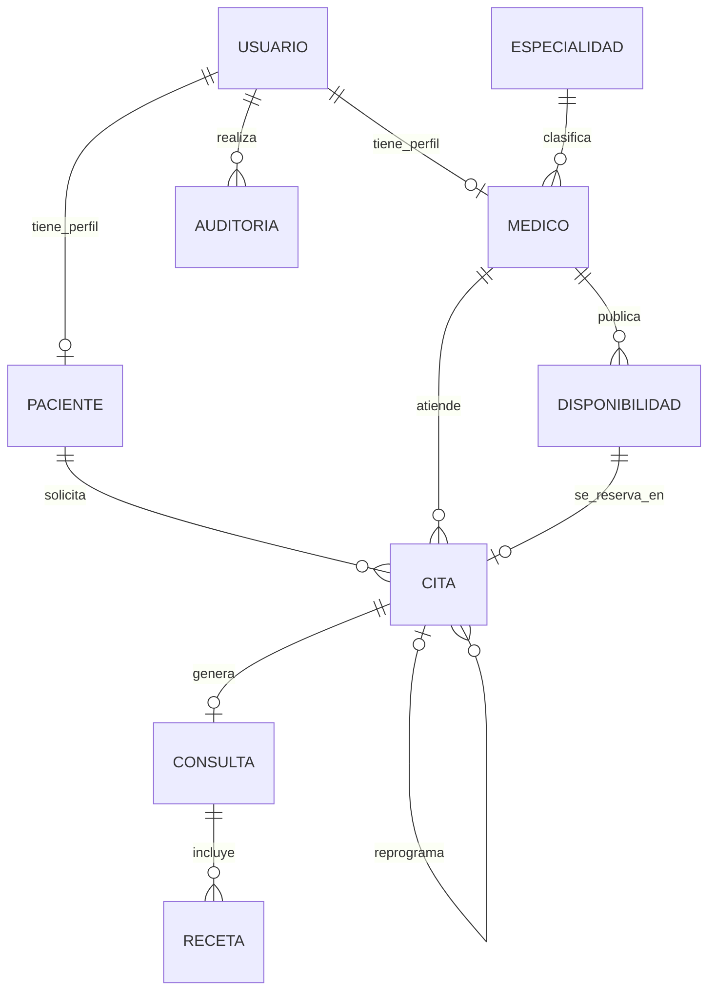

# 001 - Modelo de Datos y Dominio

## Objetivo

Definir las entidades, atributos, relaciones y restricciones necesarias para implementar el MVP de telemedicina aprobado en `docs/01-analisis/`.

Este documento define el modelo logico. No impone motor de base de datos, framework ni tipos fisicos concretos.

## Entidades

### Usuario

Representa una cuenta autenticable del sistema.

| Atributo | Regla |
|---|---|
| id | Identificador unico. |
| nombre | Obligatorio. |
| apellidos | Obligatorio. |
| correo | Obligatorio y unico. |
| contrasena_hash | Obligatorio. Nunca se almacena la contrasena en texto plano. |
| telefono | Obligatorio. |
| rol | Obligatorio: `PACIENTE`, `MEDICO` o `ADMINISTRADOR`. |
| activo | Obligatorio; permite desactivar la cuenta sin borrar su historial. |
| creado_en | Obligatorio. |
| actualizado_en | Obligatorio. |

Un Usuario tiene exactamente un rol y, segun ese rol, se asocia a un perfil Paciente o Medico. El Administrador no tiene perfil clinico.

### Paciente

Contiene los datos clinicos generales de un Usuario con rol `PACIENTE`.

| Atributo | Regla |
|---|---|
| id | Identificador unico. |
| usuario_id | Obligatorio, unico y referencia a Usuario. |
| fecha_nacimiento | Obligatorio. |
| alergias | Obligatorio; puede contener el valor `Sin alergias conocidas`. |
| antecedentes | Obligatorio; puede contener el valor `Sin antecedentes registrados`. |
| creado_en | Obligatorio. |
| actualizado_en | Obligatorio. |

### Especialidad

Clasifica a los Medicos disponibles para busqueda.

| Atributo | Regla |
|---|---|
| id | Identificador unico. |
| nombre | Obligatorio y unico. |
| activa | Obligatorio. Las especialidades usadas por Medicos activos se desactivan, no se eliminan. |
| creado_en | Obligatorio. |
| actualizado_en | Obligatorio. |

### Medico

Contiene los datos profesionales de un Usuario con rol `MEDICO`.

| Atributo | Regla |
|---|---|
| id | Identificador unico. |
| usuario_id | Obligatorio, unico y referencia a Usuario. |
| especialidad_id | Obligatorio y referencia a Especialidad activa. |
| numero_profesional | Obligatorio y unico. |
| creado_en | Obligatorio. |
| actualizado_en | Obligatorio. |

### Disponibilidad

Representa un bloque futuro que un Medico publica para recibir citas.

| Atributo | Regla |
|---|---|
| id | Identificador unico. |
| medico_id | Obligatorio y referencia a Medico. |
| inicio | Obligatorio. |
| fin | Obligatorio; debe ser exactamente 30 minutos despues de `inicio`. |
| activa | Obligatorio. |
| creado_en | Obligatorio. |
| actualizado_en | Obligatorio. |

### Cita

Registra la solicitud y el ciclo de vida de una atencion entre un Paciente y un Medico.

| Atributo | Regla |
|---|---|
| id | Identificador unico. |
| paciente_id | Obligatorio y referencia a Paciente. |
| medico_id | Obligatorio y referencia a Medico. |
| disponibilidad_id | Obligatorio y referencia al bloque de Disponibilidad reservado. |
| inicio | Obligatorio; copia el inicio de la Disponibilidad al reservar para preservar el historial. |
| fin | Obligatorio; copia el fin de la Disponibilidad al reservar. |
| estado | Obligatorio: `PENDIENTE`, `ACEPTADA`, `RECHAZADA`, `CANCELADA`, `REPROGRAMADA` o `COMPLETADA`. |
| cita_origen_id | Opcional; referencia a la Cita reprogramada. |
| creado_en | Obligatorio. |
| actualizado_en | Obligatorio. |

Al reprogramar una Cita se conserva la original con estado `REPROGRAMADA` y se crea una nueva Cita que referencia a la anterior mediante `cita_origen_id`. Esto preserva la trazabilidad del historial.

### Consulta

Representa el registro clinico generado al finalizar una Cita aceptada.

| Atributo | Regla |
|---|---|
| id | Identificador unico. |
| cita_id | Obligatorio, unico y referencia a Cita. |
| diagnostico | Obligatorio. |
| notas_clinicas | Obligatorio. Solo son visibles para el Medico asociado a la Cita. |
| fecha_consulta | Obligatorio. |
| creado_en | Obligatorio. |
| actualizado_en | Obligatorio. |

### Receta

Representa una indicacion medica simple asociada a una Consulta.

| Atributo | Regla |
|---|---|
| id | Identificador unico. |
| consulta_id | Obligatorio y referencia a Consulta. |
| medicamento | Obligatorio. |
| dosis | Obligatorio. |
| via | Obligatorio. |
| frecuencia | Obligatorio. |
| duracion | Obligatorio. |
| indicaciones | Obligatorio. |
| creado_en | Obligatorio. |
| actualizado_en | Obligatorio. |

Una Consulta puede no tener recetas o tener varias. La Receta no contiene firma digital ni pretende tener validez legal en el MVP.

### Auditoria

Registra eventos sensibles para trazabilidad interna.

| Atributo | Regla |
|---|---|
| id | Identificador unico. |
| usuario_id | Obligatorio y referencia al Usuario que ejecuta la accion. |
| accion | Obligatorio; por ejemplo, `CITA_ACEPTADA` o `CONSULTA_CREADA`. |
| entidad | Obligatorio; tipo de entidad afectada. |
| entidad_id | Obligatorio; identificador de la entidad afectada. |
| ocurrido_en | Obligatorio. |
| detalle | Opcional; no debe incluir contrasenas ni contenido clinico innecesario. |

La Auditoria es interna y no se muestra en el panel del Administrador del MVP.

## Relaciones y cardinalidades

## Restricciones de integridad

- `usuario.correo`, `medico.numero_profesional` y `especialidad.nombre` son unicos.
- `paciente.usuario_id` y `medico.usuario_id` son unicos.
- Un Usuario con rol `PACIENTE` debe tener un perfil Paciente y no un perfil Medico. Un Usuario con rol `MEDICO` debe tener un perfil Medico y no un perfil Paciente.
- La Disponibilidad debe ser futura, activa y durar exactamente 30 minutos.
- No pueden existir bloques de Disponibilidad solapados para el mismo Medico.
- Una Cita solo puede reservar una Disponibilidad activa del mismo Medico y debe copiar sus horas de inicio y fin.
- Un bloque de Disponibilidad no puede estar asociado a mas de una Cita activa (`PENDIENTE` o `ACEPTADA`).
- Solo una Cita `ACEPTADA` puede tener una Consulta, y una Cita tiene como maximo una Consulta.
- Toda Receta pertenece a una Consulta existente.
- No se eliminan Citas, Consultas ni Recetas. Las cuentas y especialidades se desactivan cuando corresponda.

## Acceso a datos clinicos

- El Paciente solo consulta sus propios datos, Citas, diagnosticos y recetas.
- El Paciente no puede consultar `notas_clinicas`.
- El Medico solo puede consultar Citas y datos clinicos vinculados a Citas donde `cita.medico_id` sea su propio identificador.
- El Administrador no puede leer ni modificar diagnosticos, notas clinicas, Recetas o datos clinicos generales del Paciente.
- La autorizacion se valida en cada consulta o accion; nunca debe depender solo de que el usuario conozca un identificador.

## Estados y transiciones de Cita

| Estado actual | Transiciones permitidas |
|---|---|
| PENDIENTE | ACEPTADA, RECHAZADA, CANCELADA, REPROGRAMADA |
| ACEPTADA | CANCELADA, REPROGRAMADA, COMPLETADA |
| RECHAZADA | Ninguna |
| CANCELADA | Ninguna |
| REPROGRAMADA | Ninguna; la nueva Cita se vincula mediante `cita_origen_id`. |
| COMPLETADA | Ninguna |

Las transiciones a `CANCELADA` o `REPROGRAMADA` solo se permiten antes de `inicio`. Solo la Cita `ACEPTADA` puede pasar a `COMPLETADA` y generar una Consulta.

## Indices recomendados

- `usuario(correo)` unico para autenticacion.
- `medico(especialidad_id)` para busqueda por especialidad.
- `disponibilidad(medico_id, inicio)` unico para evitar duplicados y optimizar agenda.
- `cita(medico_id, inicio, estado)` para validar reservas y agenda del Medico.
- `cita(paciente_id, inicio)` para historial del Paciente.
- `consulta(cita_id)` unico.
- `receta(consulta_id)` para consultar recetas de una Consulta.
- `auditoria(usuario_id, ocurrido_en)` para trazabilidad interna.

## Fuera del modelo del MVP

- Pagos, videollamadas, chat, facturacion, archivos clinicos adjuntos e integraciones externas.
- Firma digital, validacion legal o dispensa de recetas.
- Tablas para notificaciones por SMS o WhatsApp.

## Criterios de revision

- El modelo representa todos los actores y datos obligatorios aprobados.
- Las relaciones permiten agenda, Citas, historial clinico, Consultas y Recetas.
- Las restricciones impiden doble reserva y accesos clinicos no autorizados.
- El modelo conserva el historial clinico al desactivar cuentas o reprogramar Citas.
