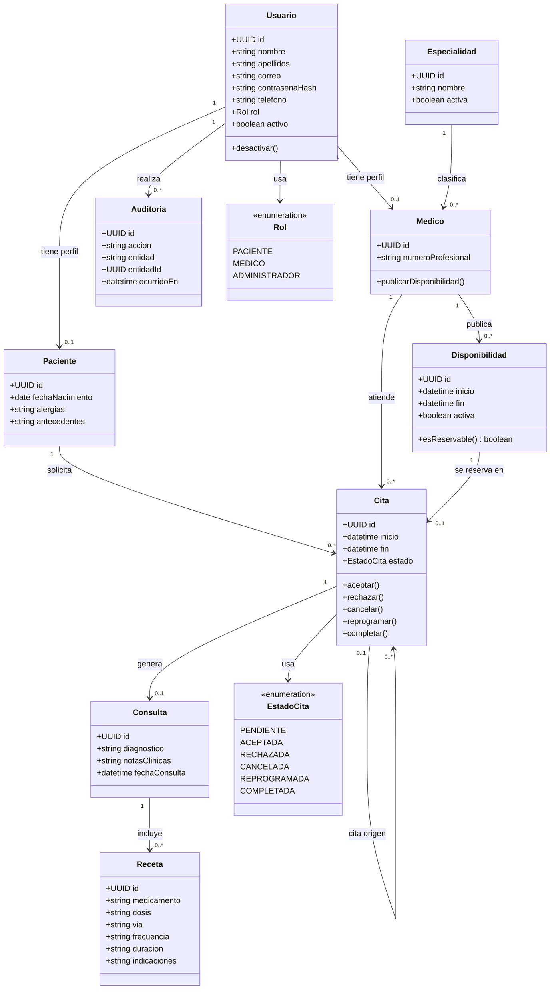

# 003 - Diagrama de Clases

## Objetivo

Representar las clases de dominio, sus atributos principales, operaciones de negocio y relaciones. Este diagrama complementa el modelo de datos; no define clases finales de codigo ni detalles de framework.

## Diagrama

## Reglas representadas

- Un Usuario tiene un solo rol y solo un perfil compatible con ese rol.
- Un Medico pertenece a una Especialidad y publica bloques de Disponibilidad de 30 minutos.
- Una Cita relaciona un Paciente, un Medico y un bloque de Disponibilidad.
- Una Cita puede generar como maximo una Consulta; una Consulta puede tener cero o varias Recetas.
- Una Cita reprogramada conserva la referencia a su Cita de origen para no perder historial.
- Auditoria registra la accion realizada por un Usuario sobre una entidad del dominio.
- Las operaciones de `Cita` solo permiten transiciones validas segun su estado y fecha/hora.

## Restricciones de acceso

- `notasClinicas` solo puede ser consultado por el Medico asociado a la Cita.
- El Paciente solo consulta sus propias Citas, diagnosticos y Recetas.
- El Administrador no puede acceder a datos clinicos ni modificar Consultas o Recetas.
