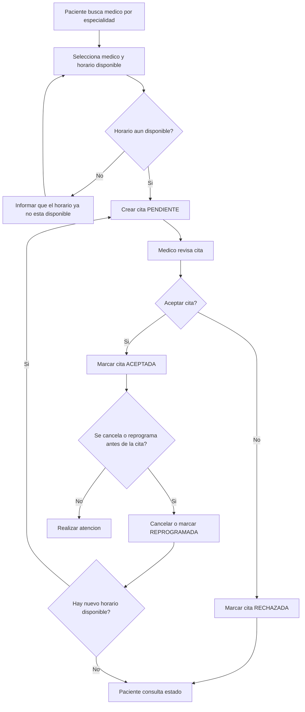
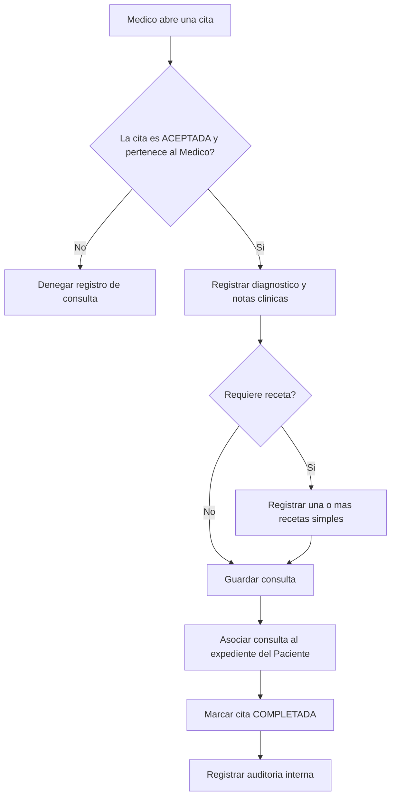

# 004 - Diagrama de Actividades

## Gestion de cita

## Registro de consulta

## Reglas reflejadas

- No se crea una Cita si el horario ya fue reservado.
- Solo el Medico asignado puede gestionar una Cita o registrar su Consulta.
- La cancelacion y reprogramacion solo ocurren antes de la fecha/hora de la Cita.
- Una Consulta solo se registra para una Cita aceptada y puede no tener Recetas.
