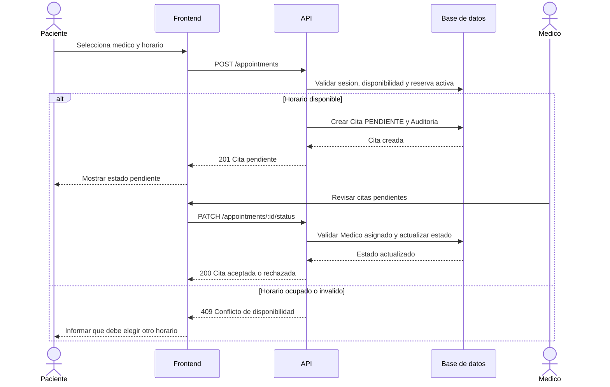
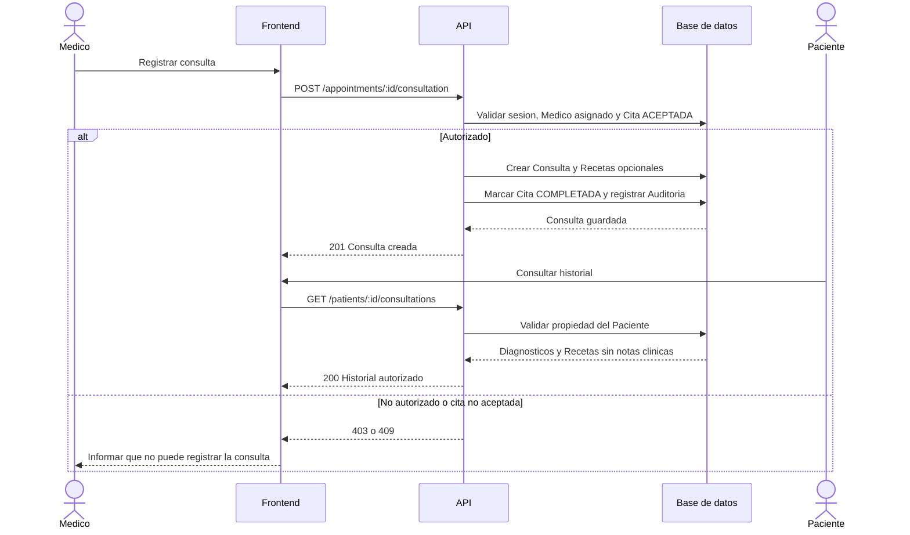

# 005 - Diagramas de Secuencia

## Solicitud de cita

## Registro de consulta y receta

## Reglas reflejadas

- La API valida permisos y reglas de negocio; el frontend no decide autorizacion.
- La reserva, la Consulta y la Auditoria se guardan mediante transacciones.
- El Paciente nunca recibe notas clinicas en las respuestas de historial.
